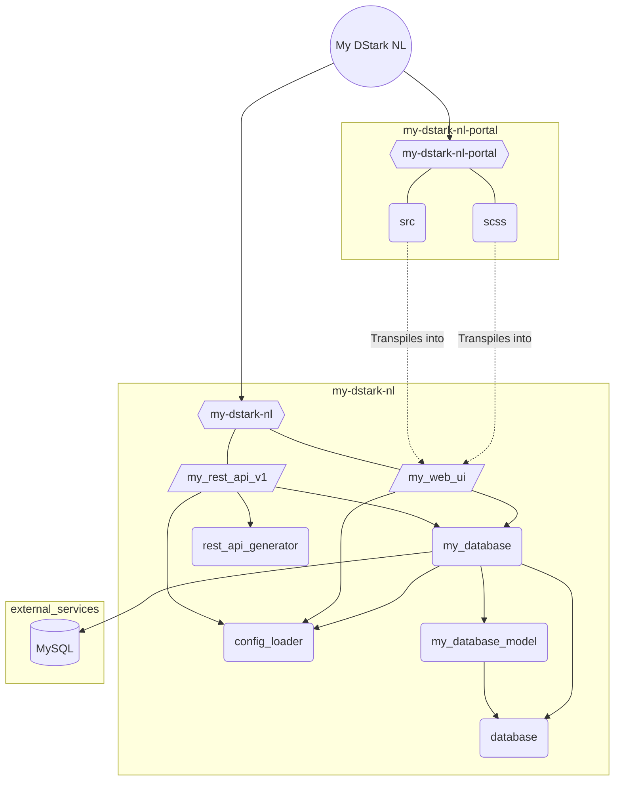

# My application model

The following model is being used:

```mermaid
graph TD
    I{{my-dstark-nl}}
    A(config_loader)
    B(database)
    C(my_database)
    D(my_database_model)
    E[/my_rest_api_v1/]
    F[/my_web_ui/]
    G(rest_api_generator)
    H[(MySQL)]

    J{{my-dstark-nl-portal}}
    K(scss)
    L(src)

    M((My DStark NL))

    M --> I
    M --> J

    subgraph my-dstark-nl-portal
    J --- K
    J --- L
    end

    
    subgraph my-dstark-nl
    I --- E
    I --- F

    E --> A
    F --> A
    D --> B
    C --> B
    C --> D
    E --> C
    F --> C
    E --> G
    C --> A
    end

    subgraph external_services
    C --> H
    end

    L -. Transpiles into ....-> F
    K -. Transpiles into ....-> F
```
