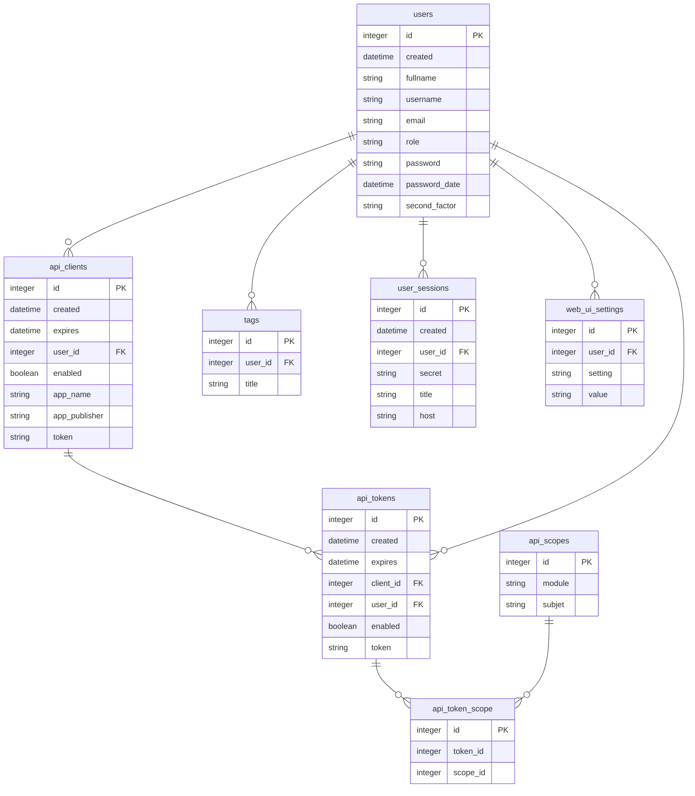

# My Database Model

The following diagram shows the database model as it is being used:

```mermaid
erDiagram
    
    %% Relationships %%

    api_clients ||--o{ api_tokens : ""
    api_tokens ||--o{ api_token_scope : ""
    api_scopes ||--o{ api_token_scope : ""
    users ||--o{ api_clients : ""
    users ||--o{ api_tokens : ""
    users ||--o{ tags : ""
    users ||--o{ user_sessions : ""
    users ||--o{ web_ui_settings : ""

    %% Tables %%

    api_clients {
        integer id PK
        datetime created
        datetime expires
        integer user_id FK
        boolean enabled
        string app_name
        string app_publisher
        string token
    }

    api_scopes {
        integer id PK
        string module
        string subjet
    }

    api_token_scope {
        integer id PK
        integer token_id
        integer scope_id
    }

    api_tokens {
        integer id PK
        datetime created
        datetime expires
        integer client_id FK
        integer user_id FK
        boolean enabled
        string token
    }

    tags {
        integer id PK
        integer user_id FK
        string title
    }

    users {
        integer id PK
        datetime created
        string fullname
        string username
        string email
        string role
        string password
        datetime password_date
        string second_factor
    }

    user_sessions {
        integer id PK
        datetime created
        integer user_id FK
        string secret
        string title
        string host
    }

    web_ui_settings {
        integer id PK
        integer user_id FK
        string setting
        string value
    }
```
